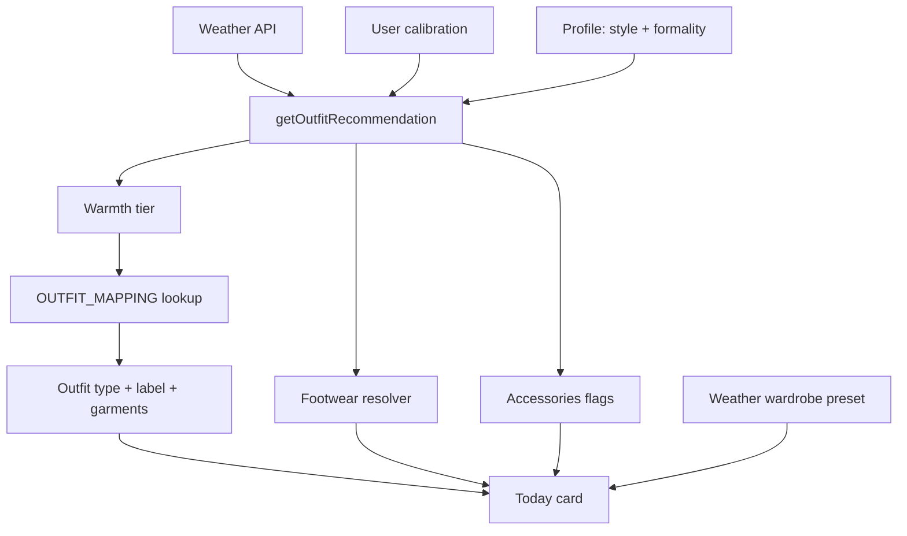

# WearToday — How clothes are picked

This document explains how the app decides what to wear, what you see on the **Today** card, and how that ties to **Wardrobe**, **Packing**, and **calibration**.

Read on GitHub or in the repo at `docs/OUTFIT_LOGIC.md` (works well on a phone in Markdown preview).

---

## 1. Big picture

WearToday does **not** use AI to pick clothes. It uses a **rules engine**:

1. Read current weather (and optional hourly forecast).
2. Apply your **calibration** (how hot/cold you run, rain tolerance, etc.).
3. Pick a **warmth tier** (how many layers the weather needs).
4. Look up a concrete **outfit type** from a table using **style** + **formality**.
5. Add **footwear** and **accessories** with separate rules.
6. Draw **icons** from the SVG catalog (or your saved **weather wardrobe** preset).



**Main code file:** `src/lib/outfit-logic.ts`

---

## 2. When recommendations run

| Trigger | What runs |
|--------|-----------|
| Weather refresh | `useWeather` → `getOutfitRecommendation` for **now** |
| Same refresh | `getDayOutfitTimeline` for **Morning / Afternoon / Evening** |
| Packing trip | `generatePackingList` (simpler day-count rules) |
| Onboarding swipes | `computeCalibrationFromSwipes` |
| Thumbs-down feedback | `computeCalibrationFromFeedback` (adjusts thresholds) |

Stored in app state: `outfit`, `outfitTimeline`, plus weather cache per city.

---

## 3. Weather inputs

### Current conditions (Today / “now”)

From `weather.current`:

- **feelsLike** — apparent temp (°F), shown in the header
- **temp** — dry-bulb air temp (used for heat index / wind chill math)
- **weatherCode** — WMO-style code (rain, snow, clear, etc.)
- **precipProb** — 0–100%
- **windSpeed** — mph
- **humidity** — %
- **isDay** — sun vs night (affects sunglasses)

### Near-term rain (important)

If hourly data exists, the engine uses the **max precip % in the next 2 hours** (`effectivePrecipProb`), not only the current snapshot. That stops a shower **later** from changing what you should wear **right now** incorrectly, and vice versa.

### Day timeline (tabs on the card)

For each period (6–12, 12–18, 18–24):

- Average **feelsLike** and **temp** across hours in that block
- Max **precipProb**, dominant **condition**, **weatherCode**
- A **separate** `getOutfitRecommendation` call per period

Timeline tabs use **algorithm icons only** (no weather wardrobe override).

---

## 4. Two “feels like” values (common confusion)

| Value | Used for |
|-------|----------|
| **feelsLike** (from API) | Card header, reason line, footer text, user-facing °F |
| **effectiveFeelsLike** | **Warmth tier** only — can apply heat index or wind chill |

**Heat index** (feels hotter): if `humidity_sensitivity` is on, feelsLike > 75°F, humidity > 40% → NWS-style heat index from **air temp + humidity**.

**Wind chill** (feels colder): if sensitivity on, feelsLike < 50°F, wind > 3 mph → wind chill from **air temp + wind**.

So the app might **dress** you for 87°F “effective” warmth while still **saying** 82°F in the text (what the thermometer/feels-like line shows).

---

## 5. Your calibration

Defaults (`DEFAULT_CALIBRATION`):

| Field | Default | Effect |
|-------|---------|--------|
| `shorts_min_temp` | 72°F | At/above → shorts territory (tier 1) |
| `light_jacket_max_temp` | 65°F | Boundary for long sleeves vs jacket bands |
| `heavy_coat_max_temp` | 45°F | Below → heavy coat tier |
| `thermal_sensitivity` | 0 (−2…+2) | Shifts all thresholds **±3°F per step** (max ±6°F) |
| `rain_tolerance` | moderate | low / moderate / high — see rain section |
| `humidity_sensitivity` | true | Enables heat index / wind chill for tier picking |

**Onboarding swipes** move `shorts_min_temp`, `light_jacket_max_temp`, `heavy_coat_max_temp`.

**Thumbs-down** (after 2 dislikes on same outfit type) nudges thresholds by 2°F within safe bounds.

---

## 6. Profile: style and formality

From your profile:

- **style_preference:** `feminine` | `masculine` | `neutral` | `all` (all → neutral)
- **formality_preference:** `casual` | `business` | `activewear`

Lookup path:

```
OUTFIT_MAPPING[warmthTier][style][formality]
```

Each cell gives: `outfitType`, `label`, `garmentTop`, `garmentBottom`, `descriptionTemplate`.

---

## 7. Is it rain? snow? heavy rain?

Computed inside `getOutfitRecommendation`:

**Rainy** if any of:

- `effectivePrecipProb` > 40%, or
- WMO codes 51–82 (drizzle/rain), or
- code ≥ 95 (thunderstorm)

**Heavy rain** if:

- precip > 70%, or
- codes 61–67 (moderate/heavy rain)

**Snowy** if codes 71–77.

**Windy** (copy notes): wind > 15 mph.

---

## 8. Warmth tier (the core decision)

Function: `resolveWarmthTier(effectiveFeelsLike, thresholds, …)`

Order of checks:

1. **Snow** → `warmth_6_snow` (winter coat messaging)
2. **Rain** (unless `rain_tolerance === "high"` — then rain is ignored for tier; you stay on dry tiers)
   - Heavy rain → `warmth_3_rain`
   - Warm rain (effective ≥ shorts threshold) → `warmth_1_rain`
   - Cooler rain → `warmth_2_rain`
3. **Dry tiers** (compare to shifted thresholds):
   - ≥ shorts → `warmth_1` (hot: shorts / dress)
   - ≥ pants+short-sleeve floor → `warmth_2`
   - ≥ light jacket max → `warmth_3`
   - ≥ heavyCoat + 15 → `warmth_4` (light jacket outfit type)
   - ≥ heavy coat max → `warmth_5`
   - else → `warmth_6` (heavy coat)

The **pants + short sleeves** floor is at least 68°F (adjusted), and stays ordered relative to your jacket thresholds.

---

## 9. Outfit types (what the algorithm picks)

| Outfit type | Typical meaning |
|-------------|-----------------|
| `shorts_tshirt` | Hot, dry |
| `dress` | Hot, dry (feminine casual path) |
| `pants_shortsleeve` | Warm, dry — tee + pants |
| `pants_longsleeve` | Mild, dry — long sleeves + pants |
| `light_jacket` | Cool, dry |
| `heavy_jacket` | Cold, dry |
| `heavy_coat` | Very cold / snow tier |
| `rain_light_shorts` | Warm rain — shell + shorts |
| `rain_light` | Cooler rain — shell + pants |
| `rain_heavy` | Heavy rain — full rain kit |

**Layer ranking** (for timeline tips): shorts/dress (1) → pants outfits (2) → light jacket / light rain (3) → heavy jacket / heavy rain (4) → heavy coat (6).

---

## 10. Footwear

Function: `resolveFootwear` — uses **effectiveFeelsLike**, rain/snow flags, outfit type, formality, rain tolerance.

Priority (simplified):

1. **Rain boots** — rain outfit + (heavy rain OR feels &lt; 70°F), unless rain tolerance is high; business may get loafers/flats instead in light warm rain.
2. **Snow boots** — snow, very cold, or heavy coat / heavy jacket outfits.
3. **Business** — loafers or dress flats (no flip-flops).
4. **Any rain** — sneakers or athletic sneakers (never flip-flops).
5. **Dry hot** — flip-flops if ≥ 85°F effective.
6. **Default** — sneakers or athletic sneakers (activewear).

**Rain display rules** (`outfitRainDisplay.ts`):

- Never show **sunglasses** when `rainGear` is true.
- Never show **flip-flops** when raining (mapped to sneakers).
- Wardrobe presets: strip sunglasses / flip-flops from saved SVGs when raining.

---

## 11. Accessories (icons only in title)

| Item | When true |
|------|-----------|
| **Sunglasses** | Not rainy, WMO 0–1, daytime, effective &gt; 68°F |
| **Scarf** | effective &lt; 35°F OR (windy and &lt; 50°F) |
| **Beanie** | effective &lt; 30°F OR snow |
| **Gloves** | effective &lt; 40°F OR snow |
| **Umbrella** | Rain + rules by formality (business always; casual for rain outfits or high precip if low rain tolerance) |
| **Rain shell** | Activewear in rain (instead of umbrella) |

Accessories appear in the **bottom-right** of the flat lay. They are **not** included in the card title or footer (by design).

---

## 12. What you see on the Today card

### Text

- **Title** — `label` from mapping (e.g. “Rain Jacket & Shorts”)
- **Reason line** — `getOutfitReason` (temp, rain %, garment hint)
- **Feels like** — raw API feels-like
- **Footer** — `description` from template + optional wind/rain/snow notes

### Icons (flat lay)

**Default:** `OutfitFlatLay` uses `outfitMap.ts` — each `outfitType` maps to default catalog SVG ids (e.g. raincoat + shorts for `rain_light_shorts`).

Grid layout:

- Top row: top garment + bottom (or full-width dress)
- Bottom row: footwear (left), accessories (right)

**Rain outline:** blue outline on the grid when `rainGear` is true.

### Text-only mode

If `outfit_display_mode === "text"`, lists garment names instead of icons (`OutfitTextView`).

---

## 13. Weather wardrobe presets (“Your Rainy Day wardrobe”)

Separate from the algorithm closet match.

**Scenario** (`getWeatherScenario` on current weather):

| Scenario | Rough rule |
|----------|------------|
| snowy | Snow codes |
| rainy | Rain rules above |
| hot | feels ≥ 72°F |
| warm | 65–71°F |
| mild | 60–64°F |
| cool | 45–59°F |
| cold | &lt; 45°F |

If you saved a preset for that scenario (`user_weather_wardrobes`), **and** you’re on the **current** period tab (Morning/Afternoon/Evening matching “now”):

- Icons come from your saved SVGs (`top_svg`, `bottom_svg`, `outerwear_svg`, `footwear_svg`, `accessory_svgs`).
- Top cell shows **outerwear if set, else top**.
- Rain sanitization removes bad footwear/accessories.

**Copy alignment** (`outfitDisplayCopy.ts`):

- Title, footer, and reason garments are rebuilt from **those same SVGs** (catalog labels), so text matches what you see.
- Accessories still icons-only.

If no preset for the scenario → algorithm icons + algorithm text.

---

## 14. Personal wardrobe matching (optional banner)

`matchWardrobeToOutfit` in `wardrobe-matching.ts` tries to match your **owned items** (with warmth ratings 1–5) to the recommendation:

- Picks tops/bottoms/outerwear whose warmth fits the outfit type’s range.
- Rain: prefers **waterproof** outerwear and rain-appropriate footwear names.
- Reports **gaps** if you’re missing categories.

This is separate from weather SVG presets; it can show “you own similar items” without changing the flat lay unless you use a preset.

---

## 15. Day timeline tips

`getLayeringTip` compares Morning vs Afternoon (and sometimes Evening):

- Rain clearing / arriving
- Morning much colder than afternoon → “start layered”
- Evening cooldown → bring a jacket

Uses outfit **warmth rank**, not exact garments.

---

## 16. Packing list (trip planner)

`generatePackingList` uses **daily** forecast stats + calibration:

- Counts hot / cold / rainy / flip-flop / sneaker / snow days
- Emits quantities (tees, shorts, jackets, rain gear, umbrella if low rain tolerance, etc.)

Simpler than the live outfit engine — good for luggage, not hour-by-hour.

---

## 17. Commute alerts

If you set commute windows, the engine can compare **hourly** conditions during commute vs now and surface an alert (different outfit suggestion for the drive). Built in `buildCommuteAlert` inside `outfit-logic.ts`.

---

## 18. SVG catalog

Clothing icons live in Supabase (`svg_clothes` table + storage bucket).

- Stable ids like `tops-neutral-tshirt`, `outerwear-neutral-raincoat`
- `StorageSvg` loads public URLs
- `useSvgCatalog` hydrates catalog on app load (cache + prefetch)

Algorithm defaults: `src/components/outfit/outfitMap.ts`.

---

## 19. Quick reference — source files

| Topic | File |
|-------|------|
| Core engine | `src/lib/outfit-logic.ts` |
| Rain display / wardrobe sanitize | `src/lib/outfitRainDisplay.ts` |
| Wardrobe preset copy | `src/lib/outfitDisplayCopy.ts` |
| Scenario → preset | `src/lib/wardrobeScenario.ts` |
| Default rainy/hot SVG sets | `src/lib/wardrobeCatalog.ts` |
| Icon maps per outfit type | `src/components/outfit/outfitMap.ts` |
| Today UI | `src/components/weather/OutfitRecommendation.tsx` |
| Weather + outfit fetch | `src/hooks/useWeather.ts` |
| Owned-item matching | `src/lib/wardrobe-matching.ts` |
| Feedback thresholds | `src/lib/outfit-feedback.ts` |
| Types | `src/types/index.ts` |

---

## 20. Example walkthrough (warm rain, casual, neutral)

1. feelsLike 82°F, humid, precip 45% in next 2h → **rainy**
2. Heat index might push **effectiveFeelsLike** to ~87°F for tier only
3. effective ≥ shorts threshold (72±) → tier **`warmth_1_rain`**
4. Mapping → **`rain_light_shorts`**, label “Rain Jacket & Shorts”
5. Footwear → **sneakers** (warm rain, not heavy)
6. Umbrella → likely on (casual + rain outfit)
7. Sunglasses → **off** (rain)
8. Footer temp in text → **82°F** (raw feelsLike)
9. If **Rainy Day** preset saved with trousers + raincoat → icons show **your** SVGs; title becomes e.g. “Raincoat & Trousers” from catalog labels

---

*Last updated to match the codebase on branch `main` (includes wardrobe copy alignment and rain footwear rules).*
